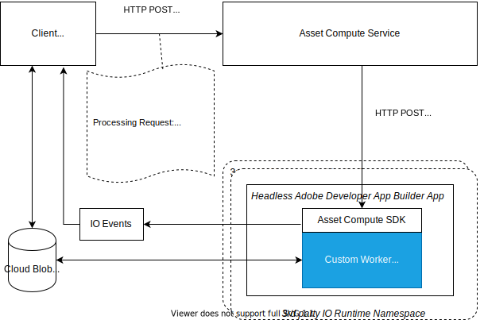

# 사용자 정의 애플리케이션 내부 {#how-custom-application-works}

다음 일러스트레이션을 사용하여 클라이언트가 사용자 지정 애플리케이션을 사용하여 디지털 에셋을 처리할 때의 통합 워크플로를 이해합니다.



*그림: 를 사용하여 에셋을 처리하는 단계 [!DNL Asset Compute Service].*

## 등록 {#registration}

클라이언트는 [`/register`](api.md#register) 에 대한 첫 번째 요청 전에 한 번 [`/process`](api.md#process-request) 수신을 위해 저널 URL을 설정하고 검색하기 위해 [!DNL Adobe I/O] Adobe Asset compute 이벤트.

```sh
curl -X POST \
  https://asset-compute.adobe.io/register \
  -H "x-ims-org-id: $ORG_ID" \
  -H "x-gw-ims-org-id: $ORG_ID" \
  -H "Authorization: Bearer $JWT_TOKEN" \
  -H "x-api-key: $API_KEY"
```

다음 [`@adobe/asset-compute-client`](https://github.com/adobe/asset-compute-client#usage) JavaScript 라이브러리는 등록, 처리에서 비동기 이벤트 처리에 이르기까지 필요한 모든 단계를 처리하는 데 NodeJS 애플리케이션에서 사용할 수 있습니다. 필수 헤더에 대한 자세한 내용은 [인증 및 권한 부여](api.md).

## 처리 중 {#processing}

클라이언트가 [처리 중](api.md#process-request) 요청.

```sh
curl -X POST \
  https://asset-compute.adobe.io/process \
  -H "x-ims-org-id: $ORG_ID" \
  -H "x-gw-ims-org-id: $ORG_ID" \
  -H "Authorization: Bearer $JWT_TOKEN" \
  -H "x-api-key: $API_KEY" \
  -d "<RENDITION_JSON>
```

클라이언트는 사전 서명된 URL을 사용하여 렌디션의 서식을 올바르게 지정합니다. 다음 [`@adobe/node-cloud-blobstore-wrapper`](https://github.com/adobe/node-cloud-blobstore-wrapper#presigned-urls) JavaScript 라이브러리는 NodeJS 애플리케이션에서 URL을 사전 서명하는 데 사용할 수 있습니다. 현재 라이브러리는 Azure Blob Storage 및 AWS S3 컨테이너만 지원합니다.

처리 요청이 다음을 반환합니다. `requestId` 폴링에 사용할 수 있습니다. [!DNL Adobe I/O] 이벤트.

샘플 사용자 정의 애플리케이션 처리 요청은 다음과 같습니다.

```json
{
    "source": "https://www.adobe.com/some-source-file.jpg",
    "renditions" : [
        {
            "worker": "https://my-project-namespace.adobeioruntime.net/api/v1/web/my-namespace-version/my-worker",
            "name": "rendition1.jpg",
            "target": "https://some-presigned-put-url-for-rendition1.jpg",
        }
    ],
    "userData": {
        "my-asset-id": "1234567890"
    }
}
```

다음 [!DNL Asset Compute Service] 사용자 정의 응용 프로그램 렌디션 요청을 사용자 정의 응용 프로그램으로 보냅니다. 제공된 애플리케이션 URL(App Builder의 보안 웹 작업 URL)에 대한 HTTP POST을 사용합니다. 모든 요청은 HTTPS 프로토콜을 사용하여 데이터 보안을 극대화합니다.

다음 [ASSET COMPUTE SDK](https://github.com/adobe/asset-compute-sdk#adobe-asset-compute-worker-sdk) 사용자 지정 애플리케이션에서 사용되는 는 HTTP POST 요청을 처리합니다. 또한 소스 다운로드, 렌디션 업로드 및 전송을 처리합니다 [!DNL Adobe I/O] 이벤트 및 오류 처리.

<!-- TBD: Add the application diagram. -->

### 애플리케이션 코드 {#application-code}

사용자 지정 코드는 로컬에서 사용할 수 있는 소스 파일(`source.path`). 다음 `rendition.path` 는 에셋 처리 요청의 최종 결과를 배치할 위치입니다. 사용자 지정 응용 프로그램은 콜백을 사용하여 로컬에서 사용 가능한 소스 파일을 전달된 이름을 사용하여 렌디션 파일로 변환합니다(`rendition.path`). 사용자 정의 응용 프로그램은에 작성해야 합니다. `rendition.path` 렌디션을 만들려면 다음 작업을 수행하십시오.

```javascript
const { worker } = require('@adobe/asset-compute-sdk');
const fs = require('fs').promises;

// worker() is the entry point in the SDK "framework".
// The asynchronous function defined is the rendition callback.
exports.main = worker(async (source, rendition) => {

    // Tip: custom worker parameters are available in rendition.instructions.
    console.log(rendition.instructions.name); // should print out `rendition.jpg`.

    // Simplest example: copy the source file to the rendition file destination so as to transfer the asset as is without processing.
    await fs.copyFile(source.path, rendition.path);
});
```

### 소스 파일 다운로드 {#download-source}

사용자 정의 응용 프로그램은 로컬 파일만 처리합니다. 소스 파일 다운로드는 [ASSET COMPUTE SDK](https://github.com/adobe/asset-compute-sdk#adobe-asset-compute-worker-sdk).

### 렌디션 만들기 {#rendition-creation}

SDK는 비동기 를 호출합니다 [렌디션 콜백 함수](https://github.com/adobe/asset-compute-sdk#rendition-callback-for-worker-required) 각 렌디션에 대해

콜백 함수는에 액세스할 수 있습니다. [소스](https://github.com/adobe/asset-compute-sdk#source) 및 [렌디션](https://github.com/adobe/asset-compute-sdk#rendition) 개체. 다음 `source.path` 가 이미 존재하고 은 소스 파일의 로컬 사본에 대한 경로입니다. 다음 `rendition.path` 는 처리된 렌디션을 저장해야 하는 경로입니다. 다음 경우가 아니면 [disableSourceDownload 플래그](https://github.com/adobe/asset-compute-sdk#worker-options-optional) 이(가) 설정되면 애플리케이션은 `rendition.path`. 그렇지 않으면 SDK에서 렌디션 파일을 찾거나 식별할 수 없으며, 실패합니다.

예제의 지나친 단순화는 사용자 정의 애플리케이션의 구조를 설명하고 집중하기 위해 수행됩니다. 소스 파일을 렌디션 대상에 복사하기만 하면 됩니다.

렌디션 콜백 매개 변수에 대한 자세한 내용은 [ASSET COMPUTE SDK API](https://github.com/adobe/asset-compute-sdk#api-details).

### 렌디션 업로드 {#upload-rendition}

각 렌디션을 만들고 다음에 의해 제공된 경로를 사용하여 파일에 저장한 후 `rendition.path`, [ASSET COMPUTE SDK](https://github.com/adobe/asset-compute-sdk#adobe-asset-compute-worker-sdk) 각 렌디션을 클라우드 스토리지(AWS 또는 Azure)에 업로드합니다. 들어오는 요청에 동일한 애플리케이션 URL을 가리키는 여러 변환이 있는 경우에만 사용자 정의 애플리케이션이 동시에 여러 변환을 가져옵니다. 클라우드 스토리지로의 업로드는 각 렌디션 후 다음 렌디션에 대한 콜백을 실행하기 전에 수행됩니다.

다음 `batchWorker()` 는 모든 렌디션을 실제로 처리하고 모두 처리된 후에만 해당 렌디션을 업로드하므로 다른 동작을 수행합니다.

## [!DNL Adobe I/O] 이벤트 {#aio-events}

SDK에서 다음을 전송함 [!DNL Adobe I/O] 각 렌디션에 대한 이벤트. 다음 이벤트는 다음 중 하나입니다. `rendition_created` 또는 `rendition_failed` 결과에 따라. 다음을 참조하십시오 [비동기 이벤트 asset compute](api.md#asynchronous-events) 이벤트 세부 사항.

## 수신 [!DNL Adobe I/O] 이벤트 {#receive-aio-events}

클라이언트가 다음을 폴링합니다. [[!DNL Adobe I/O] 이벤트 저널](https://www.adobe.io/apis/experienceplatform/events/ioeventsapi.html#/Journaling) 소비 논리에 따르면 초기 저널 URL은에 제공된 URL입니다. `/register` API 응답. 이벤트를 식별하려면 `requestId` 이벤트에 있으며 에 반환되는 것과 동일합니다. `/process`. 모든 렌디션에는 렌디션이 업로드(또는 실패)되는 즉시 전송되는 별도의 이벤트가 있습니다. 일치하는 이벤트를 수신하면 클라이언트가 결과 렌디션을 표시하거나 처리할 수 있습니다.

JavaScript 라이브러리 [`asset-compute-client`](https://github.com/adobe/asset-compute-client#usage) 을(를) 사용하여 저널 폴링을 간단하게 만듭니다. `waitActivation()` 메서드를 사용하여 모든 이벤트를 가져옵니다.

```javascript
const events = await assetCompute.waitActivation(requestId);
await Promise.all(events.map(event => {
    if (event.type === "rendition_created") {
        // get rendition from cloud storage location
    }
    else if (event.type === "rendition_failed") {
        // failed to process
    }
    else {
        // other event types
        // (could be added in the future)
    }
}));
```

저널 이벤트를 가져오는 방법에 대한 자세한 내용은 [[!DNL Adobe I/O] 이벤트 API](https://www.adobe.io/apis/experienceplatform/events/ioeventsapi.html#!adobedocs/adobeio-events/master/events-api-reference.yaml).

<!-- TBD:
* Illustration of the controls/data flow.
* Basic overview, in text and not code, of how an application works.
-->
